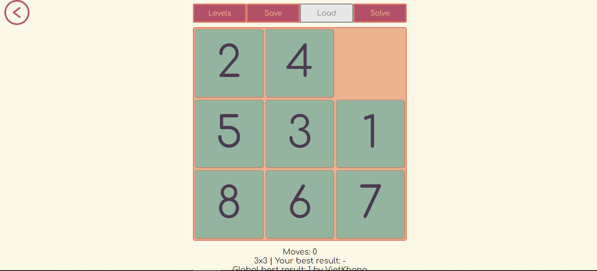

# JOGO DO NUMPUZ
👨‍🏫JOGO EM HTML/CSS/JS.

   
   

## DESCRIÇÃO:
Esse é um jogo de puzzle conhecido como "Numpuz" ou "Jogo dos 15", uma variação do clássico quebra-cabeça deslizante. 

O jogo consiste em um tabuleiro com peças numeradas que precisam ser organizadas em ordem crescente. O tabuleiro é um grid de NxN, e uma peça está faltando, deixando um espaço vazio que permite mover as outras peças. O objetivo é rearranjar as peças para que elas fiquem na sequência correta, do menor para o maior número, utilizando o menor número de movimentos possível.

## FUNCIONALIDADES:
- **Níveis de dificuldade**: O jogo oferece diferentes tamanhos de grid, de 2x2 até 9x9. O progresso do jogador é salvo localmente, permitindo desbloquear novos níveis à medida que ele avança.
- **Interface de Controle**: O jogo possui botões de navegação, como "Guides" para instruções, "Leaderboard" para exibir o placar, e controles de nível, salvar e carregar jogo.
- **Estatísticas**: O jogo acompanha o número de movimentos feitos e exibe os melhores resultados locais e globais.
- **Resolução automática**: Existe um botão para resolver o puzzle automaticamente, embora ele possa estar desativado em certas condições.
- **Leaderboard**: Um placar global exibe as pontuações e os nomes dos melhores jogadores.

## COMO JOGAR?
1. **Movimentação das Peças**: Clique nas peças ou use as setas do teclado para movê-las para o espaço vazio. Em dispositivos móveis, você também pode deslizar as peças.
2. **Objetivo**: Organize as peças na ordem numérica correta, com a peça faltando no canto inferior direito.
3. **Níveis**: Inicie com um grid de 2x2 e vá avançando conforme desbloqueia níveis maiores.
4. **Leaderboard**: Consulte o leaderboard para comparar sua pontuação com a de outros jogadores e ver quem tem o melhor tempo para cada nível.

## NÃO SABE?
- Entendemos que para manipular arquivos em `HTML`, `CSS` e outras linguagens relacionadas, é necessário possuir conhecimento nessas áreas. Para auxiliar nesse aprendizado, oferecemos cursos gratuitos disponíveis:
* [CURSO DE HTML E CSS](https://github.com/VILHALVA/CURSO-DE-HTML-E-CSS)
* [CURSO DE JAVASCRIPT](https://github.com/VILHALVA/CURSO-DE-JAVASCRIPT)
* [CONFIRA MAIS CURSOS](https://github.com/VILHALVA?tab=repositories&q=+topic:CURSO)

## CREDITOS:
- [PROJETO CRIADO PELO "vietkhang06"](https://github.com/vietkhang06/Numpuz)
- [PROJETO EDITADO PELO VILHALVA](https://github.com/VILHALVA)
